# 实验1

## 实验环境

Ubuntu 20.04 Server 64bit

### 当前 Linux 发行版基本信息

命令为:

 `lsb_release -a `

 虚拟机的发行版情况：

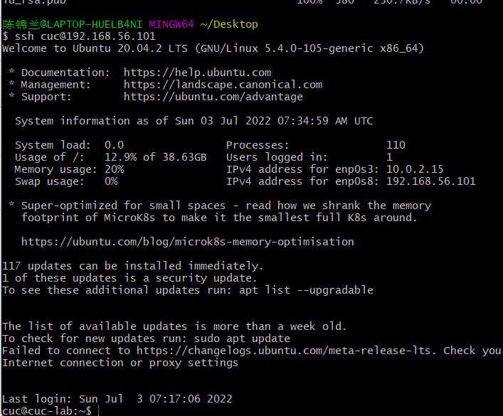

云端平台的发行版：

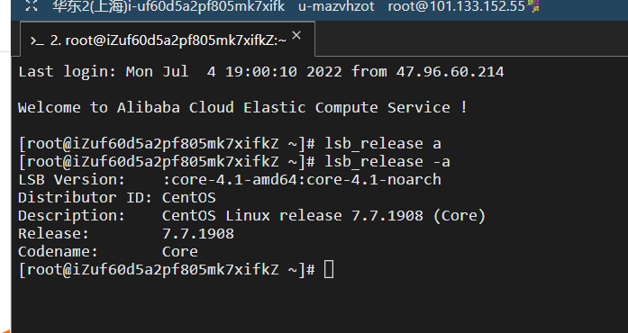

### 当前 Linux 内核版本信息

命令为：

`uname -r`

虚拟机的内核版本信息：

云端平台的内核版本：

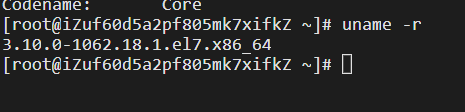

## Virtualbox 安装完 Ubuntu 之后新添加的网卡如何实现系统开机自动启用和自动获取 IP？

网卡1设置为`NAT`，新增的网卡3和网卡2保持一致，设置为`Host-only`网络。

查看网卡情况

`sudo apt install net-tools`

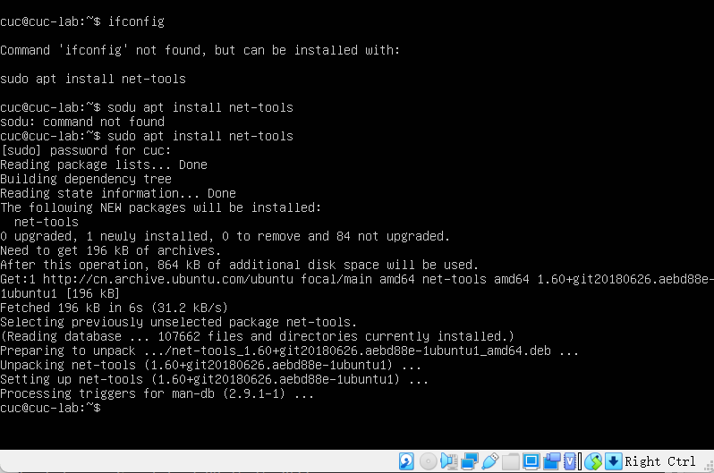

再次使用`ifconfig `和`ifconfig -a`

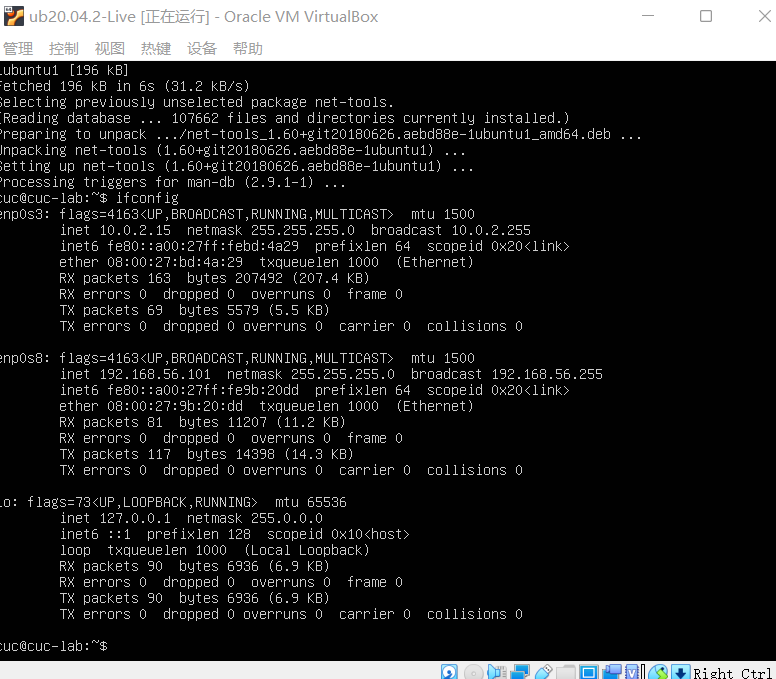

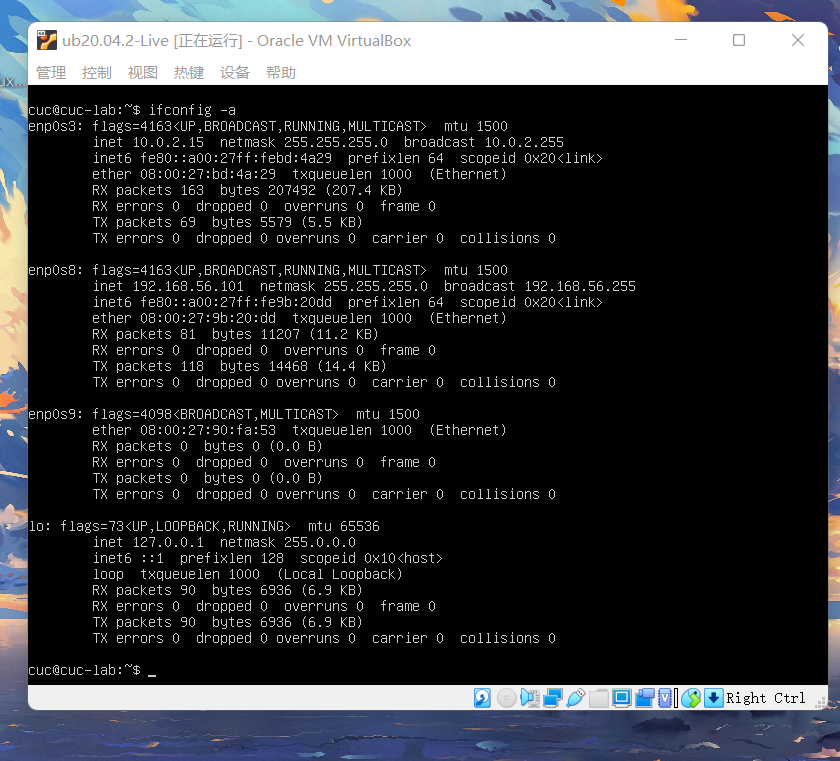

表明网卡3即 `enp0s9`,存在但是没有激活。

找到相应的`yaml` 文件：

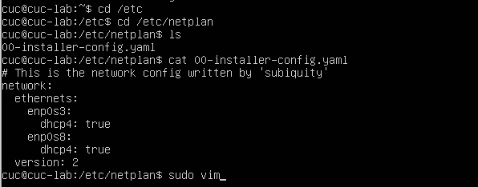

再使用 `sudo vim`指令对此文件进行修改，激活网卡3：

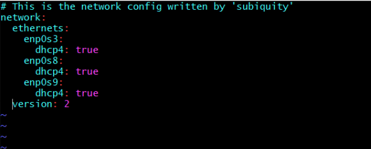

查看修改后的情况，可知网卡3已激活。

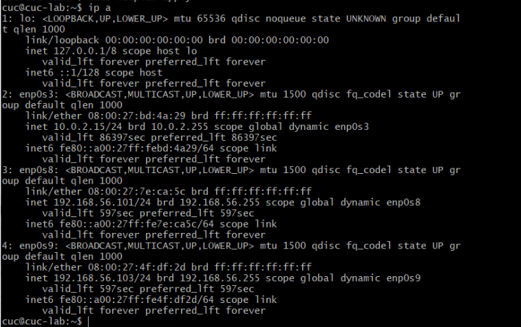

## 如何使用 scp 在「虚拟机和宿主机之间」、「本机和远程 Linux 系统之间」传输文件

### 虚拟机与宿主机

在宿主机设置一个测试文件 'Test.txt`

首先是宿主机传输文件到虚拟机：

使用指令`scp C:/Users/陈锦兰/Desktop/Test.txt cuc@192.168.56.101:~/`

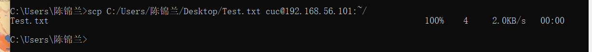

在虚拟机上查看是否收到, `ls`之后发现此目录下存在`test.txt`文件，用 `cat`命令打开即可。

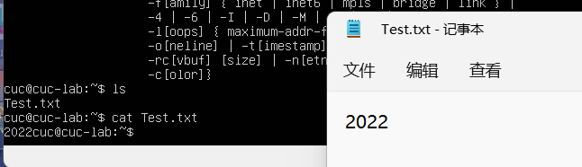

然后是虚拟机传输文件到宿主机：

指令为：`scp cuc@192.168.56.101:/home/cuc/Test.txt ./`

然后在宿主机查看是否收到：

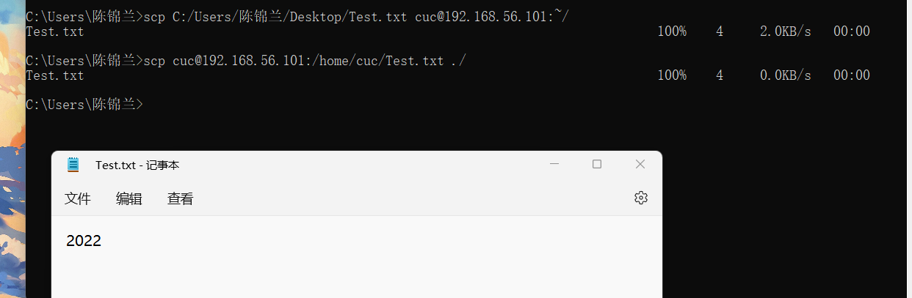

### 本地与云端 ###

本地传输到云端

指令为 `scp C:/Users/陈锦兰/Desktop/test.txt root@101.133.128.31:root`

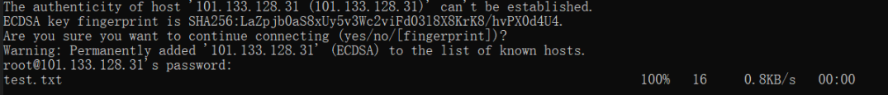

云端传输到本地

指令为  `scp root@101.133.128.31:/root/root ./`

### 如何配置 SSH 免密登录？

使用指令 `ssh-keygen -t rsa`，来生成密钥

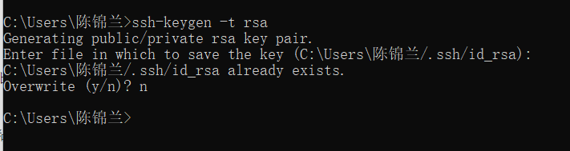

在终端中执行scp远程拷贝命令

`scp C:/Users/陈锦兰/.ssh/id_rsa.pub cuc@192.168.56.101:~/.ssh`

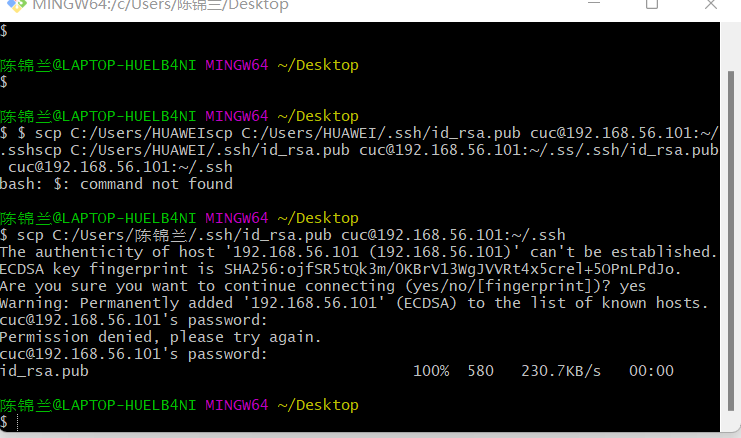

 再执行指令：`cp  id_rsa.pub  authorized_keys`,将公钥复制为authorized_keys文件

 查看结果

 

 

参考资料

https://www.jianshu.com/p/e9db116fef8c
https://blog.csdn.net/xiongyangg/article/details/110206220