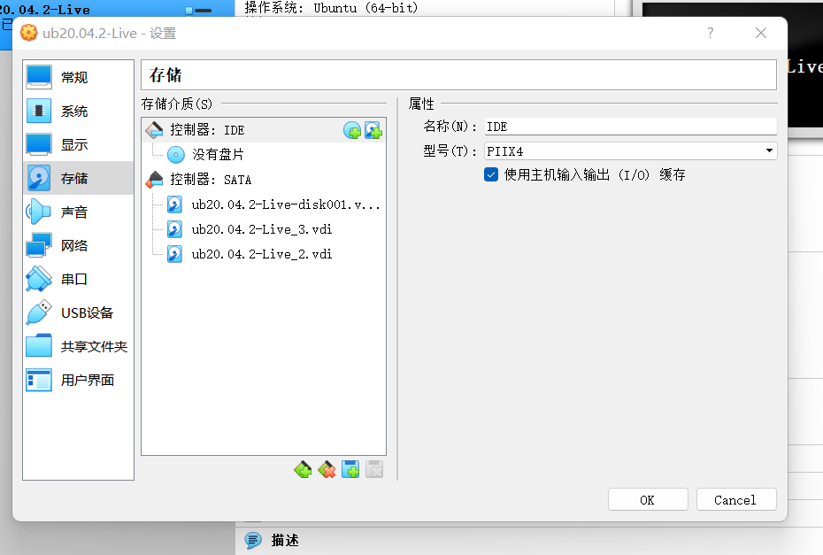

# 实验3

## 实验环境

`Ubuntu 20.04`

## 具体实验

### 查看`systemd`的版本

`systemcl --version`

### `systemd-analyze`命令用来查看启动耗时

查看启动耗时

`systemd-analyze`

查看每个服务的启动耗时

`systemd-analyze blame`

显示瀑布状的启动过程流

`systemd-analyze critical-chain`

显示指定服务的启动流

`systemd-analyze critical-chain atd.service`

 

### `hostnamectl`查看当前主机信息

显示当前主机的信息

`hostnamectl`

设置主机名

`sudo hostnamectl set-hostname lan`

[hostnamectl]
https://asciinema.org/a/zq1yPXhrgug8RiIpxBwavygZJ

 

### `localectl`查看本地化设置

查看本地化设置

`localectl`

设置本地化参数

`sudo localectl set-locale LANG=en_GB.utf8`

`sudo localectl set-keymap en_GB`

[localectl]
https://asciinema.org/a/7pvnKxNQmiKnNMTmWetyRxlT3

 

### `timedatectl`查看当前时区设置

查看当前时区设置

`timedatectl`

显示所有可用的时区

`timedatectl list-timezones`

设置当前时区

`sudo timedatectl set-timezone America/New_York`

`sudo timedatectl set-time YYYY-MM-DD`

`sudo timedatectl set-time HH:MM:SS`

[timadatectl]
 https://asciinema.org/a/wlZ79m0jmFK2GiE6MCzGGPJBZ

 

 

### `loginctl` 查看当前登录的用户

列出当前`session`

`loginctl list-sessions`

列出当前登录用户
`loginctl list-users`

列出显示指定用户的信息
`loginctl show-user cuc`

[loginctl]
https://asciinema.org/a/PtdtrHGXjnbSjhJAlQdta0Md3

 

### `systemctl list-units`查看当前系统的所有Unit

列出正在运行的 `Unit`

`systemctl list-units`

列出所有`Unit`，包括没有找到配置文件的或者启动失败的

`systemctl list-units --all`

列出所有没有运行的 `Unit`

`systemctl list-units --all --state=inactive`

列出所有加载失败的 `Unit`

`systemctl list-units --failed`

列出所有正在运行的、类型为 
`service` 的 `Unit`

`systemctl list-units --type=service`

[systemctl list-units]
 https://asciinema.org/a/7zoOgD1Qs5pFWtEHKBtnEAxfo

 

### `systemctl status`查看系统状态和单个Unit 

显示系统状态

`systemctl status`

显示单个 `Unit` 的状态

`systemctl status dbus.service`

显示远程主机的某个 `Unit` 的状态

`systemctl -H root@47.116.69.106 status dbus.service`

[systemctl status]
https://asciinema.org/a/v8rOvlU1ooWEHb2gTkKQX7QTw

 

### `systemctl`提供查询状态的其他三个方法

显示某个 `Unit` 是否正在运行

`systemctl is-active application.service`

显示某个 `Unit` 是否处于启动失败状态

`systemctl is-failed application.service`

显示某个 `Unit` 服务是否建立了启动链接

`systemctl is-enabled application.service`

[syetemctl situation]
 https://asciinema.org/a/QXMkqaFsSieCqBbQocSeSvr0W

 

### `Unit`管理命令

立即启动一个服务

`sudo systemctl start apache.service`

立即停止一个服务

`sudo systemctl stop apache.service`

重启一个服务

`sudo systemctl restart apache.service`

杀死一个服务的所有子进程

`sudo systemctl kill apache.service`

重新加载一个服务的配置文件

`sudo systemctl reload apache.service`

重载所有修改过的配置文件

`sudo systemctl daemon-reload`

显示某个 `Unit` 的所有底层参数

`systemctl show httpd.service`

显示某个` Unit` 的指定属性的值

`systemctl show -p CPUShares httpd.service`

设置某个 `Unit` 的指定属性

`sudo systemctl set-property httpd.service CPUShares=500`

[units order]
https://asciinema.org/a/VwSgb8XAR8KfTvcSgvmzqW7Jy

 

### `Unit`的依赖关系

列出一个 `Unit`的所有依赖

`systemctl list-dependencies nginx.service`

展开`target`类型的依赖

`systemctl list-dependencies --all nginx.service`

[unit depend]
https://asciinema.org/a/oGsH0WmtKlXCGgII9WMosYBHX

 

### `systemd`启动 `Unit`

开机启动
`sudo systemctl enable apache2.service`

`sudo ln -s '/usr/lib/systemd/system/apache2.service'`

撤销开机启动

`sudo systemctl disable apache2.service`

[systemd unit]
https://asciinema.org/a/5tFrCkWM2z3guObOO4mLgkamV

 

### `systemctl list-unit-files`用于列出所有配置文件 

列出所有配置文件

`systemctl list-unit-files`

列出指定类型的配置文件

`systemctl list-unit-files --type=service`

[systemctl list-unit-files]
https://asciinema.org/a/xjiKlZ8TAL9LoUwHXPYG13cIk

 

### `systemctl cat`查看配置文件内容

`systemctl cat atd.service`

 

### `target`

查看当前系统的所有 `Target`

`systemctl list-unit-files --type=target`

查看一个 `Target` 包含的所有 `Unit`

`systemctl list-dependencies multi-user.target`

查看启动时的默认 `Target`

`systemctl get-default`

设置启动时的默认 `Target`

`sudo systemctl set-default multi-user.target`

切换 `Target` 时，默认不关闭前一个 `Target` 启动的进程，
`systemctl isolate` 命令改变这种行为,关闭前一个 `Target` 里面所有不属于后一个 `Target `的进程

`sudo systemctl isolate multi-user.target`

[target]
https://asciinema.org/a/vqwkTnkzopeSNGxqDqQJqWfNS

 

### `journalctl`查看所有日志

查看所有日志（默认情况下 ，只保存本次启动的日志）

`sudo journalctl`

查看内核日志（不显示应用日志）

`sudo journalctl -k`

查看系统本次启动的日志

`sudo journalctl -b`

`sudo journalctl -b -0`

查看上一次启动的日志（需更改设置）

`sudo journalctl -b -1`

查看指定时间的日志

`sudo journalctl --since="2022-7-3 18:17:16"`

`sudo journalctl --since "20 min ago"`

`sudo journalctl --since yesterday`

显示尾部的最新10行日志

`sudo journalctl -n`

显示尾部指定行数的日志

`sudo journalctl -n 20`

实时滚动显示最新日志

`sudo journalctl -f`

查看指定服务的日志

`sudo journalctl /usr/lib/systemd/systemd`

查看指定进程的日志

`sudo journalctl _PID=1`

查看某个路径的脚本的日志

`sudo journalctl /usr/bin/bash`

查看指定用户的日志

`sudo journalctl _UID=33 --since today`

查看某个 `Unit` 的日志

`sudo journalctl -u nginx.service`

`sudo journalctl -u nginx.service --since today`

实时滚动显示某个 `Unit` 的最新日志

`sudo journalctl -u nginx.service -f`

合并显示多个 `Unit` 的日志

`journalctl -u nginx.service -u php-fpm.service --since today`

查看指定优先级（及其以上级别）的日志，共有8级

`sudo journalctl -p err -b`

日志默认分页输出，`--no-pager` 改为正常的标准输出

`sudo journalctl --no-pager`

以 `JSON` 格式（单行）输出

`sudo journalctl -b -u nginx.service -o json`

以 `JSON` 格式（多行）输出，可读性更好

`sudo journalctl -b -u nginx.serviceqq -o json-pretty`

显示日志占据的硬盘空间

`sudo journalctl --disk-usage`

指定日志文件占据的最大空间

`sudo journalctl --vacuum-size=1G`

指定日志文件保存多久
`sudo journalctl--vacuum-time=1years`

[journalctl]
 https://asciinema.org/a/WWZjL6f36rep3xw7eQYXZF4RI

 

### 开机启动、启动服务以及停止服务

`sudo systemctl enable apache2`

`sudo systemctl start apache2`

`sudo systemctl status apache2`

`sudo systemctl stop apache2.service`

`sudo systemctl kill apache2.service`

`sudo systemctl restart apache2.service`

[开机启动、启动服务以及停止服务]
https://asciinema.org/a/OsjrCo7Spn0PjaGibdBjCV3vR

 

### 查看配置文件

`systemctl cat sshd.service`

 

### 启动的target

查看 `multi-user.target` 包含的所有服务

`systemctl list-dependencies multi-user.target`

切换到另一个 `target`

`sudo systemctl isolate shutdown.target`

[target]
 https://asciinema.org/a/0pknLcK0LgWrWsi264iPZZMk1

 

### 修改配置后重启

重新加载配置文件

`sudo systemctl daemon-reload`

重启相关服务

`sudo systemctl restart apache2`

 

### 具体实验内容

### 如何添加一个用户并使其具备`sudo`执行程序的权限？

`sudo adduser jin`

`sudo usermod -G sudo jin`

[sudo]
 https://asciinema.org/a/4j8RLMI46yJm0iFyYBUQsgMnD

 

`groups jin`

 

### 如何将一个用户添加到一个用户组

`usermod -a -G <group_name> <user_name>`

 

### 如何查看当前系统的分区表和文件系统详细信息？

`df`

`sudo fdisk -l`

[df]
 https://asciinema.org/a/kdZ30pFqzoY6z1EEce9kJtBJd

 

 

### 如何实现开机自动挂载Virtualbox的共享目录分区？

在`windows`上创建一个共享文件夹，我的目录为`D:\ VirtualBox_share`

新建共享文件夹的配置情况

`sudo mkdir /mnt/share`

`sudo mount -t vboxsf VirtualBox_share /mnt/share/`

`cd /mnt/share`

`sudo vim /etc/fstab`

修改相关配置，添加上最后一行代码，并保存退出

 

### 基于`LVM`（逻辑分卷管理）的分区如何实现动态扩容和缩减容量

增加两个硬盘

`lsblk`

物理硬盘分区并写入

`lsblk`

在指定分区创建文件系统

未挂载前 `df-h`

依次挂载

挂载后`df -h`

依次卸载硬盘分区

创建物理卷

### 如何通过`systemd`设置实现在网络连通时运行一个指定脚本，在网络断开时运行另一个脚本？

 https://asciinema.org/a/Tf4UR7ciQ7lUBvjjcdXKlxET6

### 如何通过systemd设置实现一个脚本在任何情况下被杀死之后会立即重新启动？实现杀不死？

修改一下相应脚本的服务配置文件

[`service`]

`Restart=always`

`sudo systemctl daemon-reload`

再重新启动该服务即可

`sudo systemctl restart `

###  参考链接

(https://blog.51cto.com/u_13233/82677)

(https://blog.csdn.net/hexf9632/article/details/93774198)

(https://www.cnblogs.com/nxzblogs/p/11755972.html)

