# 实验五 `web`服务器

## 实验环境

`Ubuntu 20.04`

`Nginx`

`VeryNginx`

`Wordcompress 4.7`

## 实验要求

### 基本要求

#### 在一台主机（虚拟机）上同时配置`Nginx`和`VeryNginx`

VeryNginx作为本次实验的`Web App`的反向代理服务器和`WAF`

PHP-FPM进程的反向代理配置在`nginx`服务器上，`VeryNginx`服务器不直接配置Web站点服务

使用Wordpress搭建的站点对外提供访问的地址为： `http://wp.sec.cuc.edu.cn`

使用`Damn Vulnerable Web Application (DVWA)`搭建的站点对外提供访问的地址为： `http://dvwa.sec.cuc.edu.cn`

### 安全加固要求

使用`IP`地址方式均无法访问上述任意站点，并向访客展示自定义的友好错误提示信息页面`-1`

`Damn Vulnerable Web Application (DVWA)`只允许白名单上的访客来源`IP`，其他来源的IP访问均向访客展示自定义的友好错误提示信息页面`-2`

在不升级`Wordpress`版本的情况下，通过定制`VeryNginx`的访问控制策略规则，热修复`WordPress < 4.7.1 - Username Enumeration`

通过配置`VeryNginx`的`Filter`规则实现对`Damn Vulnerable Web Application (DVWA)`的`SQL`注入实验在低安全等级条件下进行防护

### `VeryNginx`配置要求

`VeryNginx`的`Web`管理页面仅允许白名单上的访客来源`IP`，其他来源的`IP`访问均向访客展示自定义的友好错误提示信息页面-3

#### 通过定制`VeryNginx`的访问控制策略规则实现

限制`DVWA`站点的单`IP`访问速率为每秒请求数 `< 50`

限制`Wordpress`站点的单`IP`访问速率为每秒请求数 `< 20`

超过访问频率限制的请求直接返回自定义错误提示信息页面-4

禁止`curl`访问

## 实验过程

### 实验前的环境准备

#### 根据路径，找到并修改本机的`host`文件

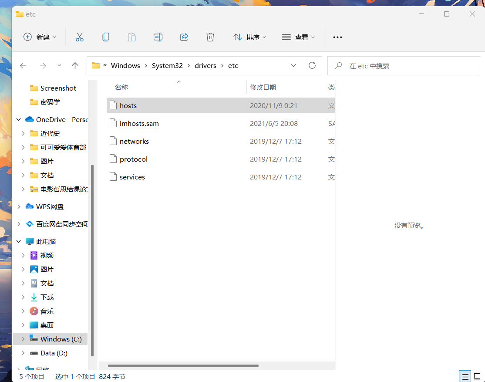

添加如下内容

`192.168.56.101 wp.sec.cuc.edu.cn`
`192.168.56.101 dvwa.sec.cuc.edu.cn`
`192.168.56.101 vn.sec.cuc.edu.cn`

#### 安装实验所需要的的软件

`sudo apt-get update`

### 安装`php`以及其依赖组件

`sudo apt-get install php-fpm php-mysql php-curl php-gd php-intl php-mbstring php-soap php-xml php-xmlrpc php-zip`

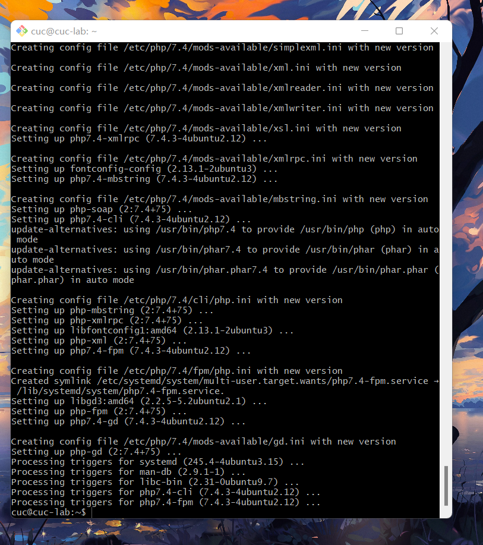

### 依照`trouble shooting`，安装缺失的库

`sudo apt-get install zlib1g-dev`

`sudo apt install libssl-dev`

`sudo apt-get install libpcre3 libpcre3-dev`
`sudo apt-get update`

`sudo apt install gcc`

`sudo apt install make`

### 安装`VeryNginx`

克隆`VeryNginx`仓库

`git clone https://github.com/alexazhou/VeryNginx.git`

`cd VeryNginx`

### 安装`python3`

`sudo python3 install.py install`


进行相关配置

使用`vim`修改 `/opt/verynginx/openresty/nginx/conf/nginx.conf` 配置文件

`sudo vim /opt/verynginx/openresty/nginx/conf/nginx.conf`

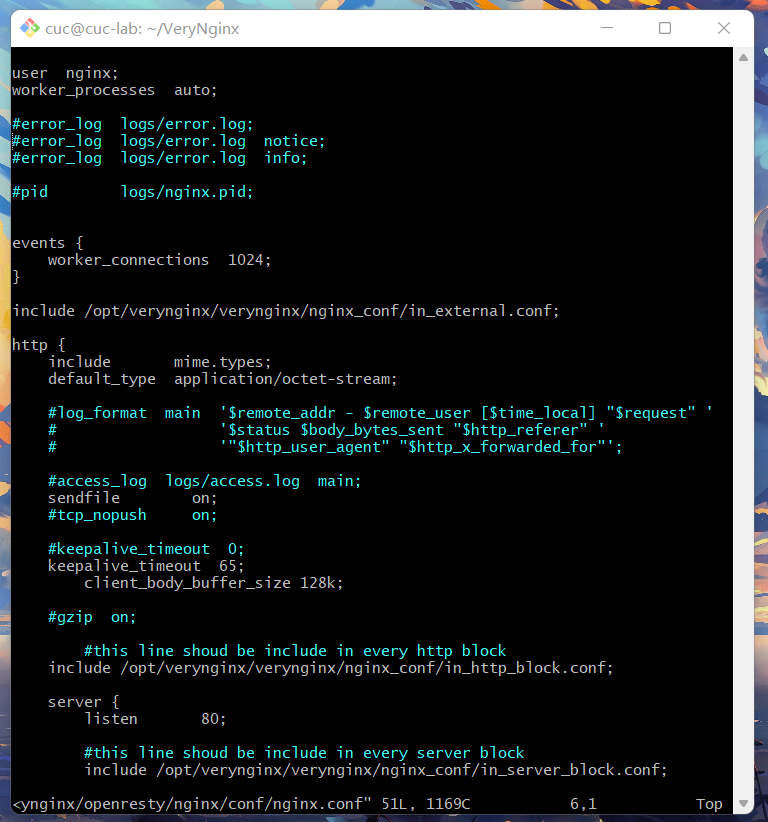

根据教学视频的内容，进行相应修改

修改用户名

`user  www-data;`

再添加一下进程的权限即可,所有用户都有读写和可执行权限

`sudo chmod -R 777 /opt/verynginx/verynginx/configs`

重启`nginx`，应用修改

`sudo /opt/verynginx/openresty/nginx/sbin/nginx -s reload`

尝试访问`80`端口，访问成功！

`192.168.56.101`


使用默认的用户名和密码`verynginx`/`verynginx` 进入`verynginx/index.html`

管理面板地址为 `http://192.168.56.101/verynginx/index.html`


### 安装`Nginx`

`sudo apt-get update`

`sudo apt-get install Nginx`

使用`vim`进入`Nginx`相关目录并修改相应内容

`sudo vim /etc/nginx/sites-enabled/default`

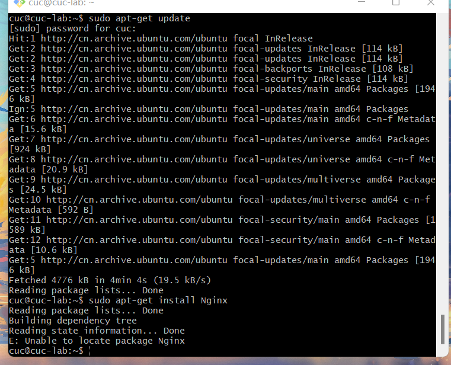

修改`root /var/www/html;`为`root /var/www/html/wp.sec.cuc.edu.cn;`；

在`# Add index.php to the list if you are using PHP`下新添加一行：

`index readme.html index.php;`

在`# With php-fpm (or other unix sockets):`
        `#       fastcgi_pass unix:/var/run/php/php7.4-fpm.sock;`下加入如下几行:

```
        #       fastcgi_index index.php;
        #      fastcgi_paramSCRIPT_FILENAME
        $document_root$fastcgi_script_name;
        #       include fastcgi_params;`
```

再次修改Nginx配置文件，将PHP-FPM进程的反向代理配置在Nginx服务器上

取消掉以下内容的注释

```
location ~ \.php$ {
    include snippets/fastcgi-php.conf;
    fastcgi_pass unix:/var/run/php/php7.4-fpm.sock;
}
```

### 安装`WordPress`

下载`WordPress 4.7`压缩包并解压

`sudo wget https://wordpress.org/wordpress-4.7.zip`

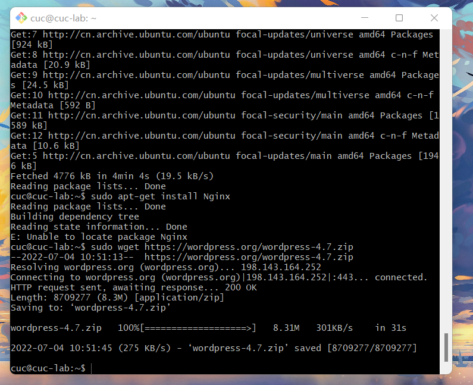

`7z x wordpress-4.7.zip`

新建目录，并将文件复制至指定目录

`sudo mkdir /var/www/html/wp.sec.cuc.edu.cn`

`sudo cp -r wordpress /var/www/html/wp.sec.cuc.edu.cn`

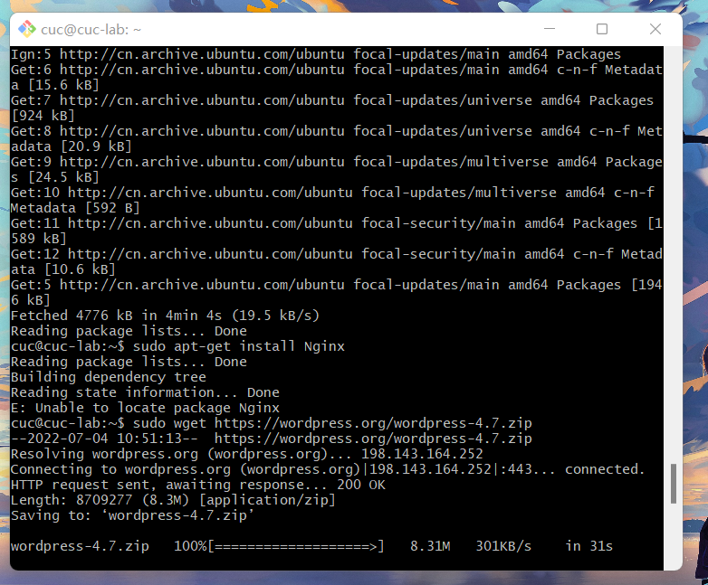

### 下载安装`mysql`数据库

`sudo apt-get install mysql-server`

`sudo mysql`

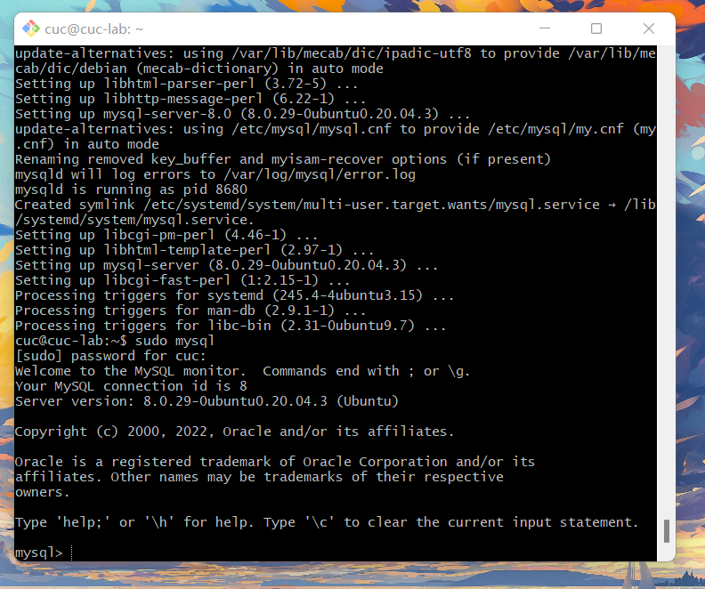

建立一个`wordpress`数据库

`CREATE DATABASE wordpress DEFAULT CHARACTER SET utf8 COLLATE utf8_unicode_ci;`

新建用户`lan`

`create user 'lan'@'localhost' identified by 'lan0903';`

授予相关权限

`grant all on wordpress.* to 'lan'@'localhost';`

刷新权限

`flush privileges;`

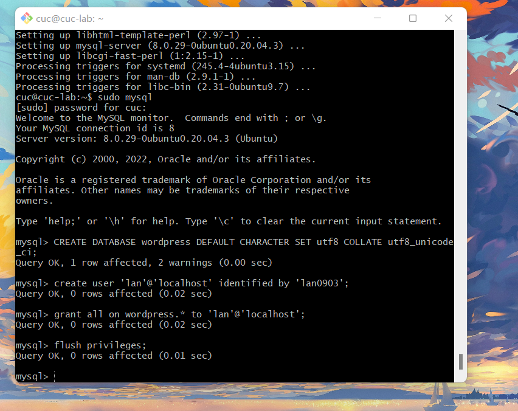

修改新建目录下的文件

`cd /var/www/html/wp.sec.cuc.edu.cn/wordpress`


`sudo vim wp-config-sample.php`

然后再修改相关配置

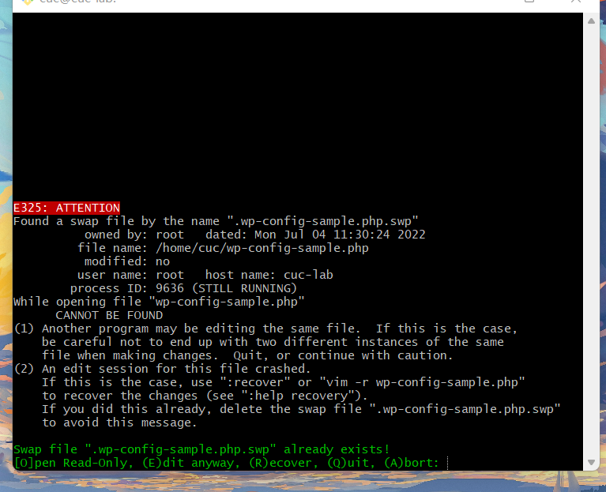

修改监听端口为`8080`

`listen 8080 default_server;`

`listen [::]:8080 default_server;`

进入网站`http://wp.sec.cuc.edu.cn:8080/wp-admin/`

### 安装`DVWA`

`git`下载

`git clone https://github.com/digininja/DVWA.git`

建立相关目录并移动文件

`sudo mkdir /var/www/html/dvwa.sec.cuc.edu.cn`

`sudo mv DVWA/* /var/www/html/dvwa.sec.cuc.edu.cn`

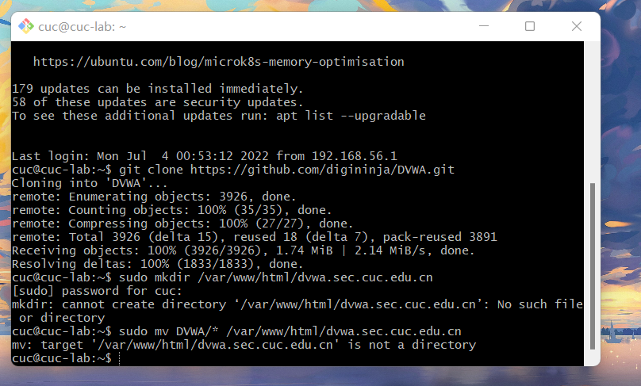

建立`DVWA`数据库，建立用户，分配权限

`sudo mysql`

`CREATE DATABASE dvwa DEFAULT CHARACTER SET utf8 COLLATE utf8_unicode_ci;`

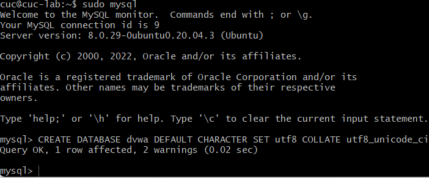

配置`php`,并修改配置内容


`sudo mv config.inc.php.dist config.inc.php`

修改`php-fpm`文件

`sudo vim /etc/php/7.4/fpm/php.ini`

状态改为`allow_url_include = On`

重启`php`

`sudo systemctl restart php7.4-fpm.service`

授权给`www-data`用户和组

`sudo chown -R www-data.www-data /var/www/html/dvwa.sec.cuc.edu.cn`

再配置相关文件

`sudo vim /etc/nginx/sites-available/dvwa.sec.cuc.edu.cn`

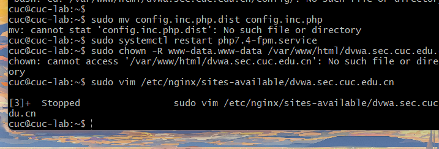