# 实验2

## 实验环境

本地虚拟机环境（Ubuntu 20.04）以及阿里云环境（CentOS 7.7）

## 实验问题

### 使用表格方式记录至少 2 个不同 Linux 发行版本上以下信息的获取方法，使用 asciinema录屏方式「分段」记录相关信息的获取过程和结果

#### 在本地虚拟机安装 `asciinema` ：

`sudo apt-get update`    

`sudo apt-get install asciinema`

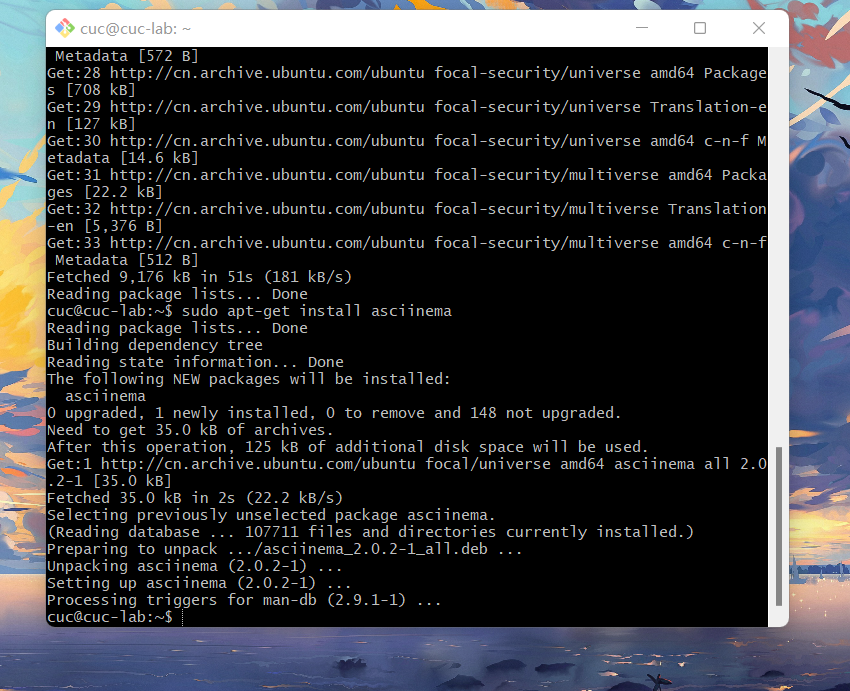

#### 在云环境安装`asciinema` ：

`yum install -y  asciinema`

`asciinema auth`

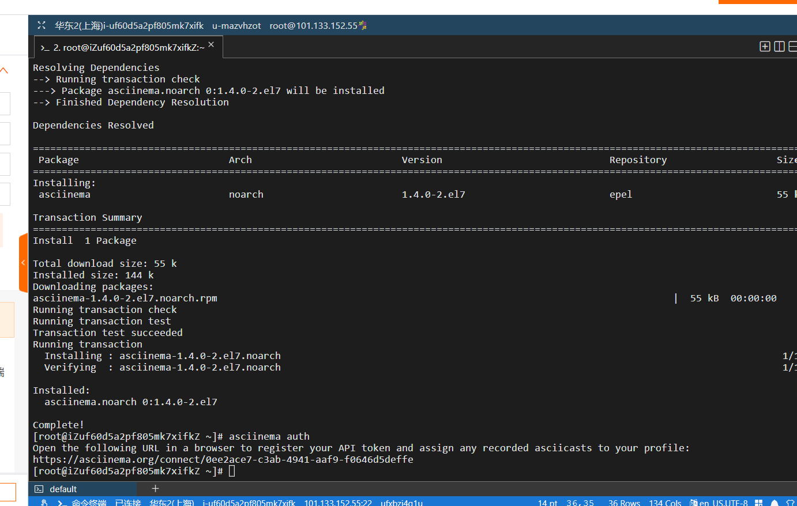

### 【软件包管理】在目标发行版上安装 tmux 和 tshark ；查看这 2 个软件被安装到哪些路径；卸载 tshark ；验证 tshark 卸载结果 ：

#### 本地虚拟机：

#### `tmux`的安装、查看路径：

`sudo apt-get install tmux`

`which tmux`

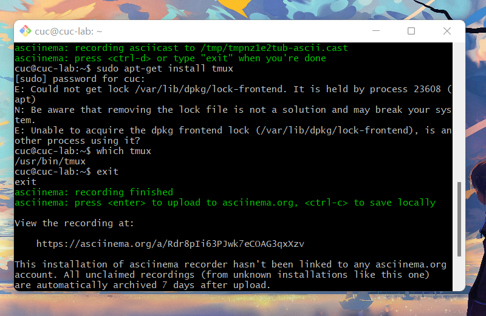

[local_tmux]
https://asciinema.org/a/Rdr8pIi63PJwk7eCOAG3qxXzv

#### `tshark`的安装卸载、查看路径

`sudo apt-get install tshark`

`which tshark`

`sudo apt-get remove --purge tshark`

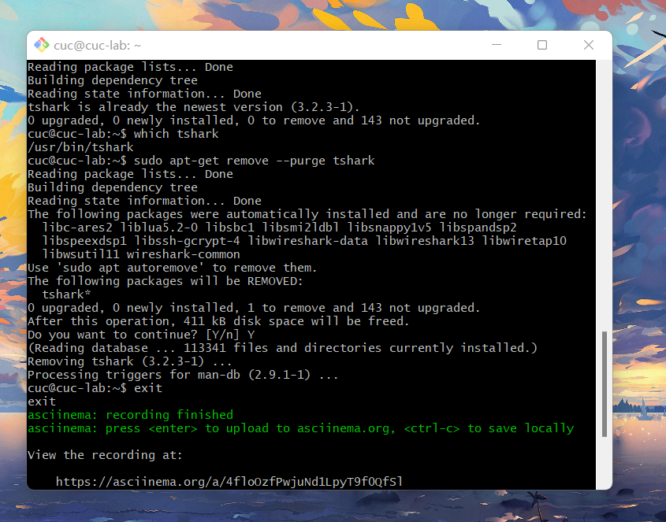

[local_tshark]
https://asciinema.org/a/4floOzfPwjuNd1LpyT9f0QfSl

#### 在云环境操作：

#### `tmux`的安装、查看路径：

`yum install tmux`

`which tmux`

[remote_tmux]
https://asciinema.org/a/w1b4u2lbq7q9XnCSbkvl7P9Nv

#### `tshark`的安装卸载、路径查看

`yum install wireshark`

`which tshark`

`yum -y remove wireshark`

`which tshark`

[remote_tshark]
https://asciinema.org/a/4bctGCGU4jDJDcTFH0HLV4H7s

### 【文件管理】复制以下 shell 代码到终端运行，在目标 Linux 发行版系统中构造测试数据集，然后回答以下问题：1.找到 /tmp 目录及其所有子目录下，文件名包含 666 的所有文件找到 2./tmp 目录及其所有子目录下，文件内容包含 666 的所有文件

#### 本地虚拟机操作:

将`shell`代码复制到终端运行：

`cd /tmp && for i in $(seq 0 1024);do dir="test-$RANDOM";mkdir "$dir";echo "$RANDOM" > "$dir/$dir-$RANDOM";done`

 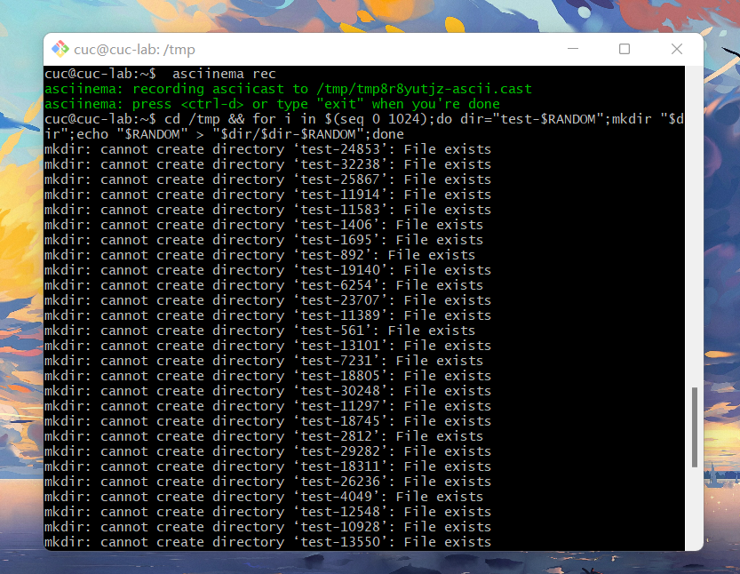

`cd /tmp`

`sudo find ./ -name '*666*'`

`sudo grep -r '666' ./`

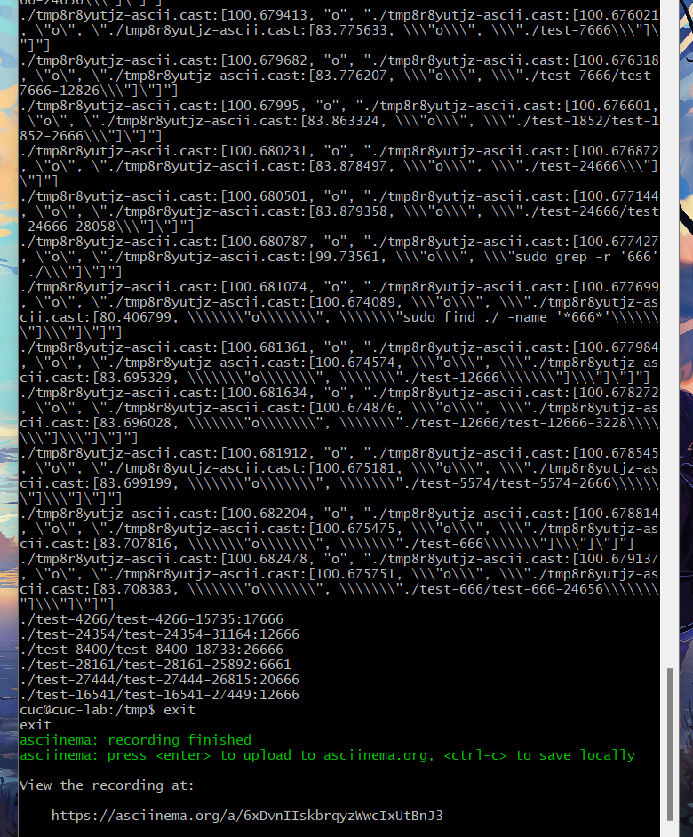

[local_check_666]
https://asciinema.org/a/6xDvnIIskbrqyzWwcIxUtBnJ3

#### 云平台操作：

此处的指令和`Ubuntu 20.04`保持一致。

将`shell`代码复制到终端运行：

`cd /tmp && for i in $(seq 0 1024);do dir="test-$RANDOM";mkdir "$dir";echo "$RANDOM" > "$dir/$dir-$RANDOM";done`

`cd /tmp`

`sudo find ./ -name '*666*'`

`sudo grep -r '666' ./`

[remote_check_666]
https://asciinema.org/a/Xy3S0QYuFlacnxzgR0WmOwzTV

### 【文件压缩与解压缩】练习课件中 文件压缩与解压缩 一节所有提到的压缩与解压缩命令的使用方法

#### 本地虚拟机操作:

测试文件为 `test.txt`
`gzip`: 

`gzip test.txt`

`gzip -d test.txt.gz`

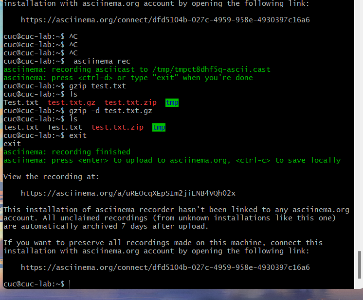

[local_gzip]
https://asciinema.org/a/uREOcqXEpSIm2jiLNB4VQh02x

`bzip2`:

`bzip2 -z test.txt`

`bzip2 -d test.txt.bz2`

[local_bzip2]
https://asciinema.org/a/OkVdOZ7WsRC00cp0LJNNPCJQH

`zip`:

`zip test.txt.zip /tmp`

`unzip test.txt.zip`

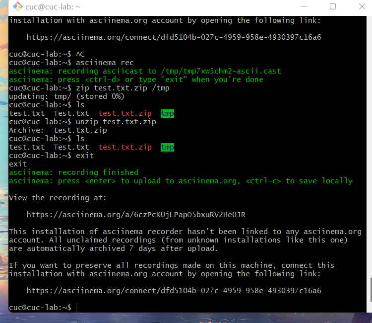

[local_zip]
https://asciinema.org/a/6czPcKUjLPapO5bxuRV2He0JR

`tar`：

`tar -czvf test-1.tar.gz test.txt`

`tar -xzvf test-1.tar.gz`

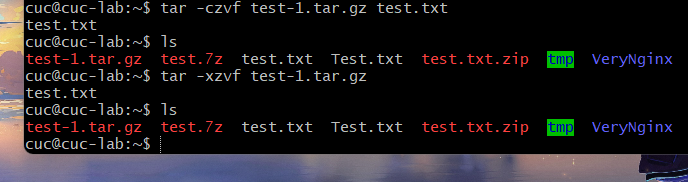

[local_tar]
https://asciinema.org/a/z6abBhZpt2TI7ZSnr5WE8j4fP

`7z`:

`7za a test.7z /test.txt`

`7za x test.7z`

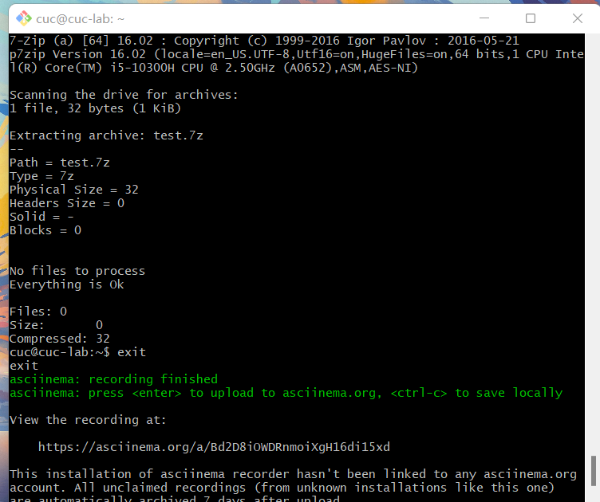

[local_7z]
https://asciinema.org/a/Bd2D8iOWDRnmoiXgH16di15xd

`rar`:

首先在本地主机上发送文件到虚拟机

通过scp指令将rar文件传输给云平台：`scp C:/Users/HUAW/Desktop/netclass.rar cuc@139.196.223.58:~/`

虚拟机执行
`unrar x netclass.rar`

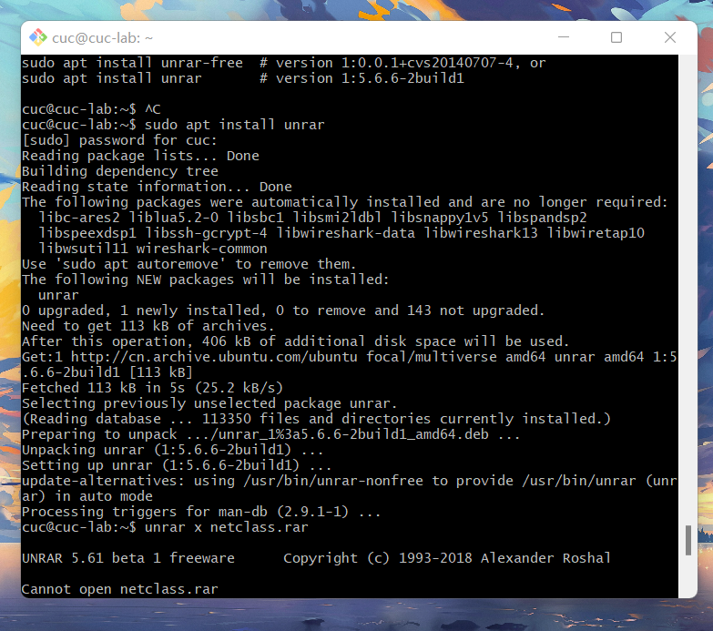

[local_rar]
 https://asciinema.org/a/Qg6ngrVTNHTiUEHKqwQlsysJt

#### 云平台操作：

测试文件为`test.txt`

通过`scp`指令将测试文件传输到云平台
`scp C:/Users/陈锦兰/Desktop/test.txt root@101.133.152.55:~/`

查看文件  `cat ./test.txt`

[remote_txt](img/remote_txt.png)

`gzip`:

`gzip test.txt`

`gzip -d test.txt.gz`

[remote_gzip]https://asciinema.org/a/RuPtrtyfHzTaSfxAGZ6HyBD5F

asc

`bzip2`:

`bzip2 -z test.txt`

`bzip2 -d test.txt.bz2`

[remote_bzip2]
https://asciinema.org/a/26TcV6GnHlGpWa5x1jPgpenr3

`zip`:

`zip test.txt.zip /tmp`

`yum install unzip`

`unzip test.txt.zip`

[remote_zip]
https://asciinema.org/a/kW0EnQk6mrXMy4axmV7sHEqsK

`tar`：

`tar -czvf test-1.tar.gz test.txt`

`tar -xzvf test-1.tar.gz`

[remote_tar]
https://asciinema.org/a/xef8jWn3DQKYJdef7708KDJby

`7z`:

`yum install -y p7zip`

`7za a test.7z /test.txt`

`7za x test.7z`

[remote_7z]
https://asciinema.org/a/mfHI6yTBFlnKYE9xg2kwYqi3j

`rar`:

首先在本地上发送文件到云环境：

通过scp指令将rar文件传输给虚拟机`scp C:/Users/陈锦兰/Desktop/netclass.rar root@101.133.133.232:~/`

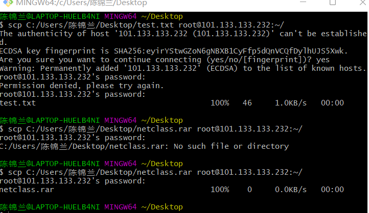

安装`rar`：

下载安装包：`wget --no-check-certificate http://www.rarlab.com/rar/rarlinux-x64-6.0.2.tar.gz`

解压安装包到目录：`tar xf rarlinux-x64-6.0.2.tar.gz -C /usr/local/`

创建软连接：
`ln -s /usr/local/rar/rar /usr/local/bin/rar`

`ln -s /usr/local/rar/unrar /usr/local/bin/unrar`

云平台执行
`unrar x netclass.rar`

[rar]
https://asciinema.org/a/iwvW04XMd2lxisYc2SCCYkEE1

### 【跟练】 子进程管理实验

#### 本地虚拟机：

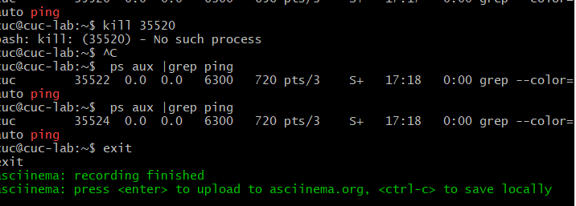

[local_exercise]
 https://asciinema.org/a/sX4y8z02aALkGe26XG4oWi4PK

#### 云平台操作：

[reomote_exercise]
https://asciinema.org/a/4NJRVOurbbutlgVQ1tELt9BTF

 

### 【硬件信息获取】目标系统的 CPU、内存大小、硬盘数量与硬盘容量

#### 本地虚拟机：

获取CPU信息 `cat /proc/cpuinfo`

获取内存信息 `free -h`

获取硬盘数量以及容量信息`df -h`

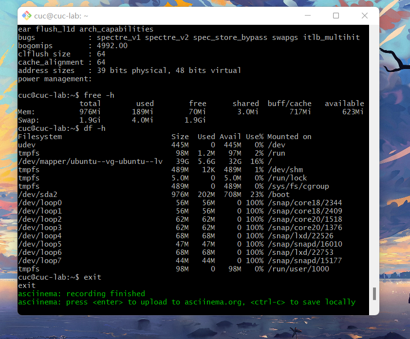

[local_checkinfo]
https://asciinema.org/a/D7AV3lZjvZW7J1yG4k2c4qyh6

#### 云平台：

获取方式与`Ubuntu`一致

获取CPU信息 `cat /proc/cpuinfo`

获取内存信息 `free -h`

获取硬盘数量以及容量信息`df -h`

[remote_checkinfo]
https://asciinema.org/a/KrqXLwtGqDyJC2GGXs3AUPQdK

 

参考链接：

`https://www.cnblogs.com/linjiqin/p/11678012.html`
`http://c.biancheng.net/linux/gzip.html`
`https://www.cnblogs.com/cnland/p/3559042.html`